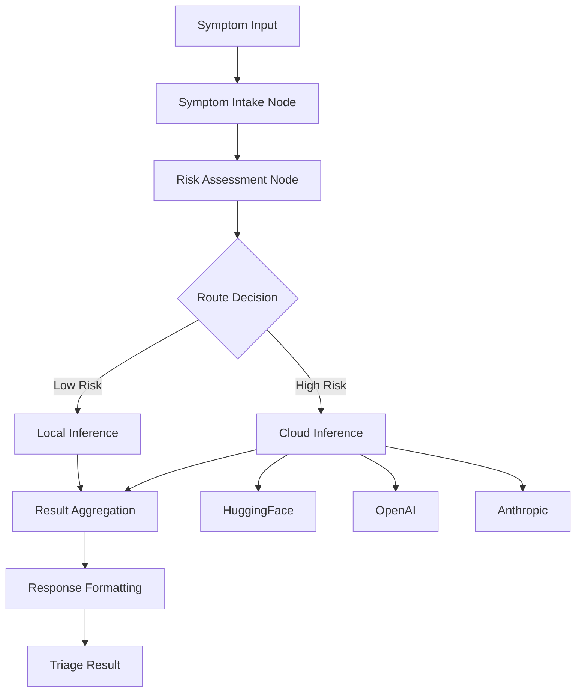

# ClinixAI LangGraph AI Integration

## Overview

ClinixAI uses **LangGraph** to orchestrate a hybrid AI inference pipeline for medical triage. The system intelligently routes between local (on-device) and cloud-based inference based on:

- **Risk Level**: Critical symptoms trigger cloud inference for maximum accuracy
- **Complexity**: Multi-system symptoms use cloud for better differential diagnosis
- **Connectivity**: Automatic fallback to local inference when offline

## Architecture



## Components

### Backend (Python/FastAPI)

```
backend/triage-service/
├── main_langgraph.py          # FastAPI app with LangGraph
├── ai/
│   ├── __init__.py
│   ├── langgraph_orchestrator.py   # Main LangGraph state machine
│   └── nodes/
│       ├── huggingface_node.py     # HuggingFace Inference API
│       ├── openai_node.py          # OpenAI GPT-4 integration
│       ├── anthropic_node.py       # Anthropic Claude integration
│       ├── local_llm_node.py       # Local LLM (llama.cpp/Cactus)
│       └── symptom_analyzer.py     # Symptom preprocessing
```

### Flutter Client

```
clinix_app/lib/core/ai/
├── cactus_service.dart         # On-device LLM (Cactus SDK)
├── clinix_ai_service.dart      # Main AI service client
├── huggingface_service.dart    # HuggingFace direct integration
└── ai_providers.dart           # Riverpod providers
```

## LangGraph State Flow

### TriageState

```python
class TriageState(TypedDict):
    # Input
    session_id: str
    symptoms: List[dict]
    vital_signs: Optional[dict]
    patient_age: Optional[int]
    patient_gender: Optional[str]
    medical_history: List[str]
    
    # Processing
    risk_score: float          # 0-1 risk assessment
    complexity_score: float    # 0-1 complexity assessment
    requires_cloud: bool       # Routing decision
    selected_provider: str     # huggingface, openai, anthropic, local
    
    # Results
    local_result: Optional[dict]
    cloud_result: Optional[dict]
    final_response: Optional[dict]
```

### Nodes

1. **SymptomIntakeNode**: Normalizes input, extracts keywords, calculates initial risk
2. **RiskAssessmentNode**: Determines routing based on thresholds
3. **LocalInferenceNode**: Rule-based or local LLM analysis
4. **CloudInferenceNode**: Orchestrates cloud provider calls with fallback chain
5. **ResultAggregationNode**: Combines and validates results
6. **ResponseFormattingNode**: Formats final response with disclaimer

## AI Providers

### HuggingFace (Default Cloud)
- **Models**: Mistral-7B-Instruct, BART-large-MNLI
- **Use Case**: Cost-effective cloud inference
- **Fallback**: Zero-shot classification when generation fails

### OpenAI (High Accuracy)
- **Models**: GPT-4o, GPT-4o-mini
- **Use Case**: Critical cases requiring maximum accuracy
- **Features**: JSON mode, structured output

### Anthropic (Safety-First)
- **Models**: Claude 3.5 Sonnet, Claude 3 Haiku
- **Use Case**: Nuanced medical reasoning
- **Features**: Long context, careful safety considerations

### Local LLM (Offline)
- **Backends**: llama.cpp, ctransformers, Cactus SDK
- **Models**: LFM2-1.2B-RAG, Phi-3 Mini
- **Use Case**: Offline operation, data privacy

## Configuration

### Environment Variables

```bash
# Cloud Providers
OPENAI_API_KEY=sk-...
ANTHROPIC_API_KEY=sk-ant-...
HUGGINGFACE_API_KEY=hf_...

# Routing Thresholds
AI_CLOUD_RISK_THRESHOLD=0.6      # Risk score to trigger cloud
AI_CLOUD_COMPLEXITY_THRESHOLD=0.5 # Complexity score for cloud

# Local LLM
LOCAL_LLM_BACKEND=rule_based     # llama_cpp, ctransformers, cactus
LOCAL_LLM_MODEL_PATH=models/lfm2-1.2b-rag-q4_k_m.gguf
LOCAL_LLM_MAX_TOKENS=256
LOCAL_LLM_TEMPERATURE=0.3
```

## API Endpoints

### Analyze Triage
```bash
POST /analyze
Content-Type: application/json

{
  "session_id": "unique-session-id",
  "symptoms": [
    {"description": "Severe headache", "severity": 8, "duration_hours": 24},
    {"description": "High fever", "severity": 7}
  ],
  "vital_signs": {
    "temperature": 39.5,
    "heart_rate": 95
  },
  "patient_age": 35,
  "patient_gender": "female"
}
```

### Response
```json
{
  "session_id": "unique-session-id",
  "urgency_level": "urgent",
  "confidence_score": 0.85,
  "primary_assessment": "High fever with severe headache requires prompt evaluation",
  "recommended_action": "Visit healthcare facility within 2-4 hours",
  "differential_diagnoses": [
    {"condition": "Malaria", "probability": 0.7, "reasoning": "Endemic area, fever pattern"},
    {"condition": "Typhoid", "probability": 0.5, "reasoning": "Fever with headache"}
  ],
  "red_flags": ["High fever >39°C"],
  "follow_up_questions": ["Have you traveled recently?"],
  "provider_used": "huggingface",
  "inference_time_ms": 1250,
  "escalated_to_cloud": true
}
```

### Graph Visualization
```bash
GET /graph

# Returns Mermaid diagram of the inference pipeline
```

### Health Check
```bash
GET /health

{
  "status": "healthy",
  "service": "clinixai-triage-service",
  "version": "2.0.0",
  "ai_providers": {
    "huggingface": "configured",
    "openai": "configured",
    "anthropic": "not_configured"
  }
}
```

## Flutter Integration

### Using ClinixAIService

```dart
final service = ClinixAIService.instance;
await service.initialize(config: AIServiceConfig.production());

final result = await service.analyzeTriage(
  sessionId: uuid.v4(),
  symptoms: [
    SymptomInput(
      description: 'Severe chest pain',
      severity: 9,
      durationHours: 1,
    ),
  ],
  vitalSigns: VitalSignsInput(
    heartRate: 110,
    bloodPressure: '150/95',
  ),
  patientAge: 55,
  patientGender: 'male',
);

if (result.urgencyLevel == UrgencyLevel.critical) {
  // Show emergency alert
}
```

### Using Riverpod

```dart
final analysisState = ref.watch(triageAnalysisProvider);
final analyzeNotifier = ref.read(triageAnalysisProvider.notifier);

// Trigger analysis
await analyzeNotifier.analyze(
  sessionId: sessionId,
  symptoms: symptoms,
);

// Access result
if (analysisState.isLoading) {
  // Show loading
} else if (analysisState.result != null) {
  // Show result
} else if (analysisState.error != null) {
  // Show error
}
```

## Africa-Specific Features

The AI system includes special handling for:

- **Endemic Diseases**: Malaria, typhoid, cholera, TB, yellow fever
- **Resource Limitations**: Recommendations account for healthcare access
- **Regional Patterns**: Symptom interpretation for African contexts

## Development

### Run with Docker

```bash
# Start all services
docker-compose up -d

# View logs
docker-compose logs -f triage-service

# Test API
curl http://localhost:8000/health
```

### Run Locally

```bash
cd backend/triage-service

# Install dependencies
pip install -r requirements.txt

# Run with uvicorn
uvicorn main_langgraph:app --reload --host 0.0.0.0 --port 8000
```

## Testing

```bash
# Test triage analysis
curl -X POST http://localhost:8000/analyze \
  -H "Content-Type: application/json" \
  -d '{
    "session_id": "test-001",
    "symptoms": [
      {"description": "Severe headache", "severity": 8},
      {"description": "High fever", "severity": 7, "duration_hours": 48}
    ],
    "patient_age": 30
  }'
```

## Performance Targets

| Metric | Target | Notes |
|--------|--------|-------|
| Local inference | <500ms | Rule-based fallback |
| Cloud inference | <3s | With provider fallback |
| Critical detection | >95% | Sensitivity for emergencies |
| Offline capability | 100% | Local always available |
